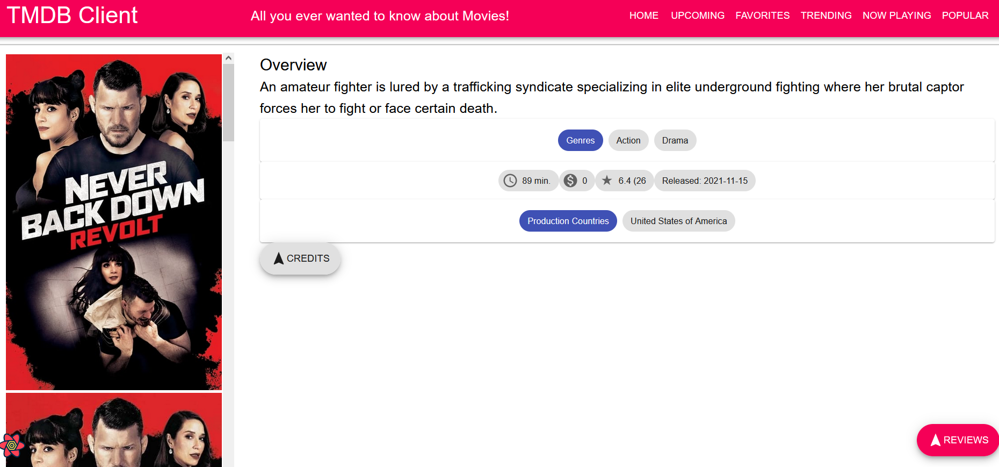

# Assignment 1 - ReactJS app.

Name: Constantin Suttner

## Overview.

Created 3 new views and 3 new endpoints popular and now_playing movies and trending ones. Also I tried to create credits for the movies for the parameterized URL, but unfortunately couldn't finish it in time as I'm travelling back home to Germany.

### Features.
[ A bullet-point list of the __new features__ you added to the Movies Fan app (and any modifications to existing features) .]
 
+ Trending movies page (./images/trending.png)
+ Popular movies page (./images/popular.png)
+ Now playing movies page (./images/nowPlaying.png)
(+ Credits for movies)
+ included new site header page options

## API endpoints.

[ List the __additional__ TMDB endpoints used, giving the description and pathname for each one.] 

e.g.
+ Trending list of movies - /trending/movie/week
+ popular movies - /movie/popular
+ Movies which are playing right now - /movie/now_playing
(+ Credits for movies - /movie/${id}/credits)

((  ### Component catalogue.

+movieCredit

>Stores variables for name, character and apartment of actor for the movie

movieCredits

>Drop down menu with credits

movieCreditPage

>Displays name, character and apartment of actor for the movi

 
>Includes new button for credits))

### Routing.

+ /trending - Shows movies that are trending for the past week
+ /movies/popular - Shows movies that are popular right now
+ /movies/now_playing - Shows movies that are now playing in the cinema
(+ /credits/:id - Shows credits of the movie)

#On a final note I find it unfortunate that I invested time and did all the labs but could not build out the assignment to its full potential. 
There is no YouTube Video because I don't have any additional feature like persistence changes and I would just skip through the 4 pages for the minimal requirements to pass the assignment. 